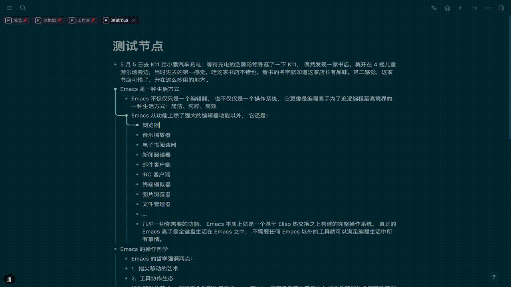
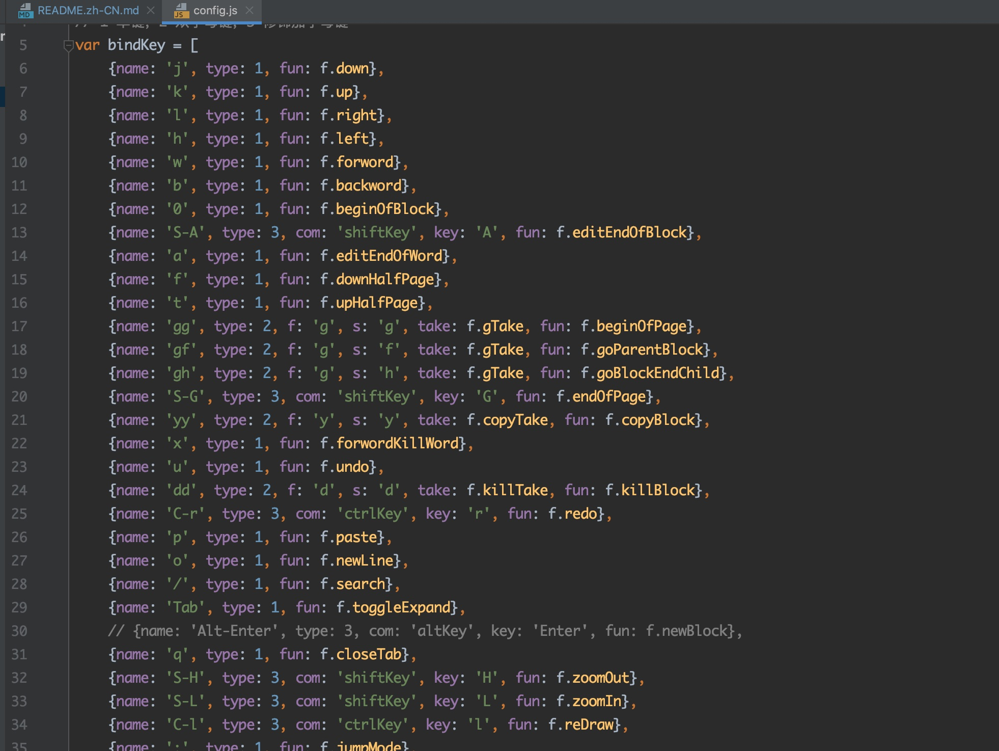

# vim-wyatt-logseq-plugin
The purpose of this plugin is to give logseq a vim-like editing experience. 
中文文档在项目里 [`README.zh-CN.md`](https://github.com/j-wyatt-a/vim-wyatt-logseq-plugin/blob/main/README.zh-CN.md "中文版")


## Supported keys
- `j` moves the cursor down
- `k` moves the cursor up
- The specific content is here `src/config`
  
- The current key position should be enough for me, you can customize it if you need it
## draw the focus
- Currently, the top reference can only be accessed by loading the plugin locally by means of Load unpacked plugin.
- I couldn't have done this without the api that the logseq team has released
## Origin
I have always used emacs to write things, and the combination of emacs + evil makes my writing a pleasure. The artifact will get tired after using it for a long time. At this time, logseq came into my field of vision, so I wanted to change my taste.
But logseq does not have a vim-like editing experience, which has been preventing me from using logseq.

Originally, I thought that without this function for a day, I would not use it for a day (indicating that I have been paying attention to others secretly). Then one day I saw the plugin logseq-plugin-vim-shortcuts and thought that I could finally get into the pit.
Then found out that I was still too young to move the cursor. But this developer gave me the courage to try to implement it myself.

At present, some main functions have been realized, and I can completely enter the pit logseq. Hope it helps you happy hacking too!

## Main principle
````js
// Monitor the key input of the main page
top.document.onkeydown = async function (e) {
  console.log(e)

  // Prevent keys from entering characters in the text box, and then recognize them as commands
  e.preventDefault()

  // After pressing the esc key, the cursor still disappears because it is not intercepted
  let blockUUID = await logseq.Editor.getCurrentBlock();
  // Now use this method to re-enter edit mode, it will reproduce the cursor
  await logseq.Editor.editBlock(blockUUID.uuid);
}
````
The point is that the top object, as far as I understand it, has such shortcomings.
- Logseq plugins published in the market run in an iframe sandbox in a separate domain by default, so visit
- The ability to reference the top view of the main view (pointing to the window object of the main view) is prohibited by the cross-origin security policy.
- Currently, the top reference can only be accessed by loading the plugin locally by means of Load unpacked plugin.
- Because the API is not used, the stability is questionable
- I have not tried this shortcoming. I do not plan to release it to the market. If you like it, you can do it yourself. This is the purpose of my open source it. After all, if such a plugin already exists, I don't have to write it myself.

## grateful
- logseq
- logseq-plugin-vim-shortcuts

## Licence
MIT
